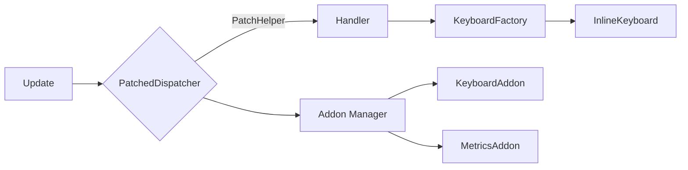

# Integration Playbook

This playbook demonstrates how PyKeyboard and Pyrogram Patch complement each other when building a production-grade Telegram bot.

## Architecture snapshot

1. **PatchedDispatcher** receives updates and determines whether a handler opts into patch features.
2. **PatchHelper** instances surface session state, locale preferences, and addon utilities to handlers.
3. **KeyboardAddon** provisions preset/theme registries and adaptive locale helpers for consistent keyboards.
4. **InlineKeyboard** renders the final layout, assisted by visualization metrics when needed.

## Recommended flow

1. Load the `KeyboardAddon` via configuration using `AddonManager.load_addons_from_config`.
2. Register presets and themes during addon initialization to keep layout rules centralized.
3. Inside handlers, call `patch_helper.keyboards.build()` (or your wrapper) to compose keyboards with cached locale preferences.
4. Use the health dashboard route to monitor breaker status, pool utilisation, and metrics during rollout.

## Observability tips

- Attach the metrics addon to export Prometheus-compatible counters for keyboard build durations and handler throughput.
- Enable visualization performance snapshots in staging to compare layout iteration cost before deploying to production.

> **Next steps:** Try the [Pyrogram keyboard quickstart](../tutorials/pyrogram-keyboard-quickstart.md) to wire everything together.
